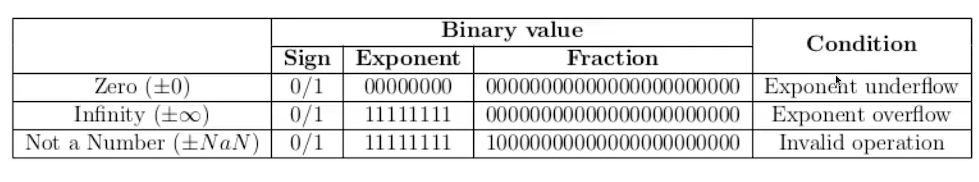
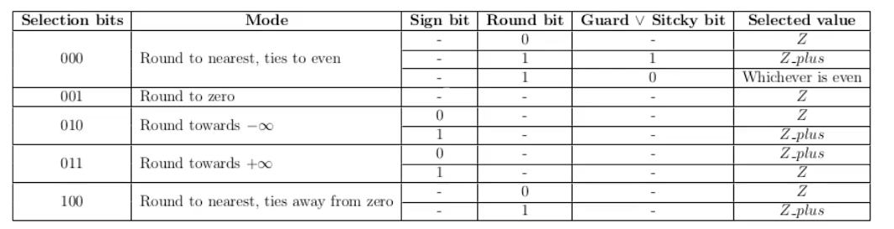

# How does this work anyway?

- Si el exponente es 0 el dut redondea el valor a NaN -> Valores subnormales (xd)

## Valores especiales

NaN representa valores inválidos como dividir entre 0

## Redondeo

- 000 -> 3 bits extra para ver si redondeo -> Este es como el único complicao'
- 001 -> No voy a redondear 
- 010 -> Me fijo en el bit de signo para redondear
- 011 -> Me fijo en el bit de signo para redondear pero al revés del caso 010
- 100 -> Me fijo en el round bit para redondear

### Remember to remove this when we are donezo